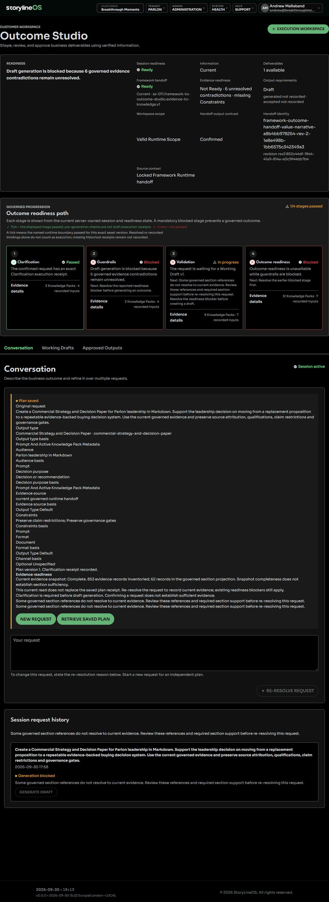

# Outcome Studio readiness

Outcome Studio has two different readiness questions:

- **Foundation/preflight readiness**: the locked runtime, handoff, evidence sufficient for required sections, output contract, and request plan are eligible for governed execution. This can allow Framework Guidance and Working Draft to run.
- **Full governed readiness**: every stage in the persisted quality chain has passed and its receipt is linked to the same runtime instance, plan, draft, and draft iteration. Only this state can proceed to customer-ready approval.

## Stage-specific blockers

The stage path is fail-closed:

- **Framework Guidance** — the governed handoff or guidance execution is missing, stale, or failed.
- **Working Draft** — the draft provider did not produce a valid evidence-bound draft, or its predecessor lineage is invalid.
- **ARL Meaning Review** — an actual rejection identifies changes to meaning, reality-layer classification, evidence use or decision usefulness. A stage that did not run, failed to execute or has invalid lineage is a separate execution blocker; it is not an ARL meaning rejection.
- **Outcome Narrative Plan** — blocked until ARL Meaning Review has passed and its actual stage receipt is available.
- **Output Shaping** — blocked until the narrative plan is persisted and predecessor fingerprints match.
- **Rendered-Expression RL** — blocked until the shaped candidate is persisted and the rendered-expression review passes.

An available workspace does not establish that a particular request is ready. Use the request-specific blocker, affected section or reference and next action. The workspace identifies the specific blocker. A green foundation stage, resolved pack, or recorded binding does not prove that the corresponding quality stage executed.

## Snapshot completeness and section support

The evidence readiness panel distinguishes reading the evidence set from establishing that it supports the requested output:

- **Incomplete snapshot:** Outcome Studio could not verify the full in-scope set. Generate Draft stays disabled before drafting or ARL calls. Ask a workspace administrator to review the reported read boundary, then resolve the request again after that boundary is corrected. A partial read must not be treated as complete.
- **Complete snapshot with clarification required:** all in-scope records were inventoried, but required support remains unresolved. Review the named source reference, contradiction, constraint, decision, authority or economic input. More records or a complete count alone do not satisfy these requirements.
- **Ready to draft:** the snapshot, selected output contract and all other required readiness checks are satisfied. This permits drafting; it does not grant ARL approval or customer-ready status.

The current snapshot read is a diagnostic. It does not replace the evidence receipt saved with a request plan or clear existing blockers. Resolve the request again to bind the plan to current governed evidence after an authorized correction. An unresolved optional section may be omitted only under the selected schema's explicit omission rule; unresolved required sections still need clarification.

### Development example

This recorded example from 30 September 2026 shows a complete inventory of 853 records with 62 records in the governed section projection. Six contradiction candidates, missing Constraints and unresolved section references still block Generate Draft. Candidates require evaluation of provenance, scope, time and materiality before a contradiction is established. The counts and readiness are historical, not a current status for your workspace.

## Evidence and retry rules

The section ledger distinguishes supported sections, partial support, metadata-only sections, unresolved sections and optional omissions permitted by the selected schema. Partial support and metadata do not establish the missing customer claims. A required unresolved section shows the affected section, exact stored reference or missing input, clarification question and next action. Legacy and scoped-view references remain visible until resolved through the governed workflow.

A contradiction candidate is retained with its source references. Compatible qualification or evidence about different scopes or times does not automatically block a section; unresolved provenance or materiality still needs review. The handoff never resolves the underlying evidence automatically.

**Insufficient handoff** means drafting stops before the Working Draft provider or ARL call. Resolve the exact source or claim requirement through the governed runtime workflow, then resolve the request again. **Provider failure** means a preparation or drafting provider call failed. A response that fails deterministic validation is a validation failure; a valid response that cannot be saved is a persistence failure. These are separate from an ARL meaning rejection. Invalid prose is not saved as a Working Draft, and a generated response alone does not prove that a Working Draft was persisted. **ARL meaning rejection** means an actual draft reached meaning review and needs the identified correction. Readiness does not guarantee that ARL will accept a draft.

Outcome Studio uses the accepted evidence already bound to the locked runtime. It does not ask the customer to upload another copy to bypass a governed gate. Provider receipts, stage execution IDs, predecessor fingerprints, and audit records must remain consistent. Earlier stages may already have been saved when a later step fails. Retrieve the saved request and inspect its recorded stages before deciding what to do next. Eligible retries verify source and predecessor lineage and reuse valid completed work; stale or changed inputs require re-resolution. Historical records remain preserved. Do not retry repeatedly to seek an ARL pass.

Evidence readiness is checked against the selected output schema. Required sections need admissible current evidence with exact source references, validation status, attribution and qualifications. Accepted status alone is insufficient. Framework guidance remains separate from customer evidence and cannot support a customer claim.

If a required section is unresolved or unsupported, generation and meaning review stop before a provider call. The clarification identifies the affected sections and what must be resolved. An optional unresolved section may be omitted only if the selected schema explicitly permits it; it cannot be silently treated as complete.

If the governed evidence snapshot or output binding cannot be verified, section sufficiency has not yet been assessed. Ask a workspace administrator to review that readiness boundary before resolving the request again; this does not establish that customer evidence is missing.

Review the identified evidence through the governed runtime workflow, then resolve the request again, or select a compatible output schema. Request confirmation and evidence availability do not establish independent validation, decision authority or ARL approval. Recovery preserves source attribution and qualifications; it does not automatically collect or change evidence.

If the source revision is locked, use the authorized governed revision workflow rather than editing its saved evidence. A provider failure needs its own diagnosis; an ARL finding needs the identified meaning correction. Neither can be cleared by treating an incomplete snapshot as complete or weakening a required-section rule. See [Outcome Studio](outcome-studio.md) for the clarification workflow.

If any mandatory stage is missing, failed, incomplete, or not linked to the current lineage, the result remains foundation-only or blocked and cannot be presented as a fully governed outcome. Help publication remains pending repository binding and read-back. Other release or acceptance checks remain separate from this runtime status.
